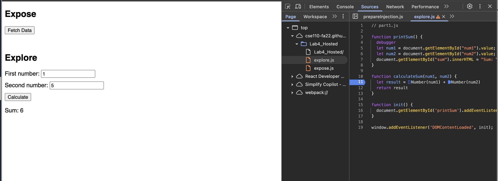

1. The bug was that the two numbers were interpreted as strings by Javascript so when we added `num1` and `num2`, the program concatenated the two. 
2. To fix this bug, I would simply cast `num1` and `num2` to a number as shown below. 
